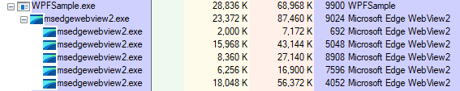

# Testing machine

All these tests were executed on the Microsoft provided
[Windows 10 development virtual machine](https://developer.microsoft.com/en-us/windows/downloads/virtual-machines/)
running on Hyper-V. This machine has 4096MB of RAM assigned (no dynamic) and 1 virtual processor.
SmartScreen has been disabled on the VM and no other applications
are running in the Guest or the Host.

The host machine is a Surface Laptop 3 with 16GB of memory and an Intel(R) Core(TM) i7-1065G7 CPU.

The versions used in these tests are:

* Electron 13.1.4
* WV2: SDK 1.0.864.35, Runtime 91.0.864
* .NET: 5.0

# IPC

Goal is to measure the speed of IPC under different circumstances.
Time in ms, average of 5 runs.

## Roundtrip: Renderer -> Main -> Renderer in burst

The time it takes to send roundtrip 1,000 and 10,000 messages at the same time
This allow us to see how the pipe handles congestion.

|                              | 1,000 / avg | 10,000 / avg |
| -----------------------------|------------:|-------------:|
| Electron (context isolation) | 414ms / 229.8ms | 2,021ms / 949.4ms |
| Electron (node integration)  | 138ms /  68.1ms | 1,349ms / 627.5ms |
| WV2 (C#)                     | 604ms / 332.5ms | 5,408ms / 2713.8ms|
| WV2 (C++)                    |                 |                   |

## Roundtrip: Renderer -> Main -> Renderer sequentially

The time it takes to send roundtrip 1,000 and 10,000 messages one by one.
This measures the raw speed of sending messages under ideal circumstances.

|                              | 1,000 / avg | 10,000 / avg |
|------------------------------|------------:|-------------:|
| Electron (context isolation) | 211.9ms / 0.21ms | 2,400ms / 0.24ms |
| Electron (node integration)  | 165.8ms / 0.16ms | 1,316ms / 0.13ms |
| WV2 (C#)                     | 612.6ms / 0.61ms | 6,075ms / 0.61ms |
| WV2 (C++)                    |                 |                   |

As expected, the average speed of the message is relatively constant regardless of
the number of messages sent.

**Note:** The C++ still needs to be updated to work with the latest version of
WV2. Also it will stringufies and parses on the JavaScript side because
my C++ skills are non-existent and I've been unable to send an object and
parse/serialize in C++.

# Startup and memory time

This challenge measures how long it takes to get an application fully started. The code being
executed is https://ahfarmer.github.io/calculator/. The reason is that all resources are
loaded from the same domain (no ads, tracking, etc.) and it is built in React, which is widely
used.
The applications are compiled in Release mode (when applicable) and launched from the command
line. The executions is recorded with Camtasia and the time is measured from the moment the
cursor dissappears from the line to the moment the application is fully rendered.
The applications were executed a few times to make sure they always took about the same time.
The video can be found in [./recordings/electron-wv2-startup-time.mp4](./recordings/electron-wv2-startup-time.mp4)

| Technology       | Time |
| ---------------- | ---: |
| Electron         |     s|
| WV2 + NET5 + WPF |     s|
| WV2 + Win32 (C++)|     s|

**Note**: The video is from an old version of WV2 and Electron, needs to be
re-recorded.

And these are the results for memory and number of processes:

| Technology | # Processes | Total private bytes | Total working set |
| ---        |        ---: |                ---: |              ---: |
| Electron   |           4 |             78,940K |          226,396K |
| WV2 C++    |           7 |             77,748K |          268,248K |
| WV2 WPF    |           7 |            102,840K |          307,156K |

# CPU

Goal is to calculate all the primer numbers under 10,000,000 while still having the UI being responsive. The UI is updated about 250ms.

Time in ms, average of 5 runs.

|          | 10,000,000 |
| ---------|-----------:|
| Electron |    4,456ms |
| WPF      |    4,181ms |

# File access

Goal is to read and write large numbers of files of different sizes (4k and 1MB) without blocking the UI thread.
`async/await` is used in JavaScript and C# to perform all I/O operations.

## Time to write and read 10,000 files of 4k each

times in ms, average of 5 runs

|          | Write files | Read dir | Sequential Read | Concurrent Read |
| ---------|------------:|---------:|----------------:|----------------:|
| Electron |       6,218 |       21 |           8,751 |           1,059 |
| WebView2 |      10,585 |       82 |          13,470 |           5,936 |
| WPF      |       4,101 |        4 |           1,848 |             448 |

## Time to write and read 10,000 files of 1Mb each

times in ms, average of 5 runs

|          | Write files | Read dir | Sequential Read | Concurrent Read |
| ---------|------------:|---------:|----------------:|----------------:|
| Electron |      29,215 |       34 |          17,518 |           4,602 |
| WebView2 |      43,250 |       98 |          86,222 |          35,753 |
| WPF      |      25,729 |        6 |          29,536 |           3,417 |

In WebView 2 files are read in C# and then a message is sent to the WebView with the contents.
"Concurrent read" reads up to 100 files concurrently.
